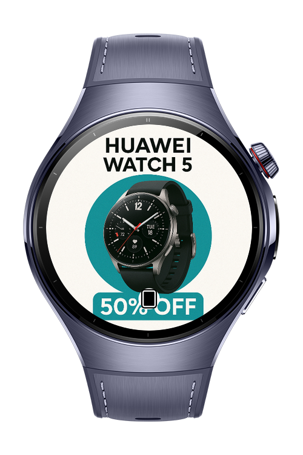
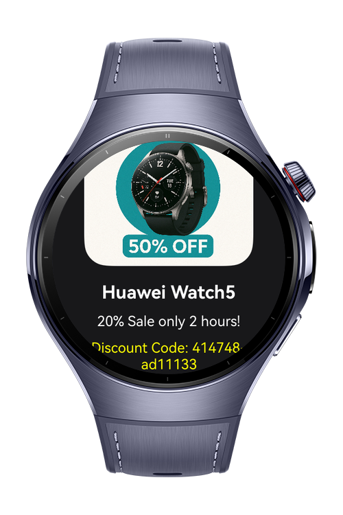
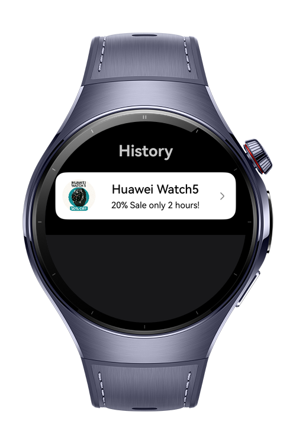
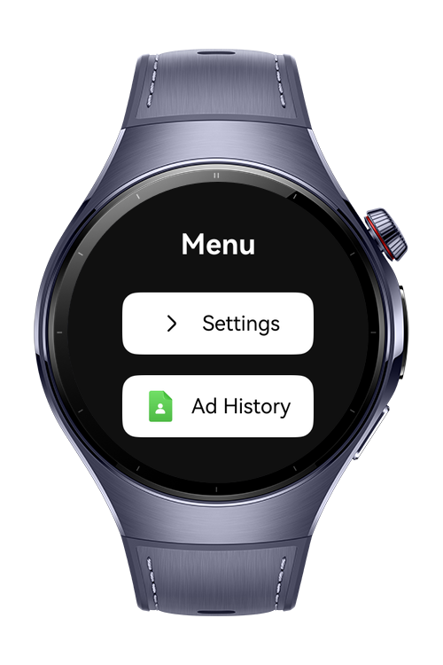

> **Note:** To access all shared projects, get information about environment setup, and view other guides, please visit [Explore-In-HMOS-Wearable Index](https://github.com/Explore-In-HMOS-Wearable/hmos-index).

# Smart Ad Beacon

Turn your smartwatch into a smart advertising companion. With Smart Ad Beacon, users receive personalized promotions directly on their Huawei Watch 5 when passing by beacon-enabled stores in shopping malls.

No intrusive flyers or promoters waving hands — just timely, relevant, and digital notifications on the wrist.

# Preview
<div>
  
  
  
  
</div>

# Use Cases

A beacon device is placed at the store entrance.

When the user with a smartwatch passes nearby, the watch detects the beacon signal.

The watch instantly shows a promotional notification (e.g., “50% off coffee today”).

The user can tap the notification to open the Ad Detail Page for full campaign info.

All received ads are stored in the Ad History Page, so users can revisit them later.

# Technology
## Stack
- **Languages**: ArkTS
- **Frameworks**: ArkUI, HarmonyOS 5.1.0(18)
- **Kits Used**:
    - @kit.ConnectivityKit (BLE scanning)
    - @kit.AbilityKit (permissions, background task)
    - @kit.PerformanceAnalysisKit (logging)
    - @kit.NotificationKit (ads as smartwatch notifications)
    - @kit.CoreFileKit (storage for ad history)
## Required Permissions
  - ohos.permission.DISCOVER_BLUETOOTH
    Required to scan nearby beacon devices.
  - ohos.permission.USE_BLUETOOTH
    Required to enable Bluetooth communication.
  - ohos.permission.NOTIFICATION_CONTROLLER
    Required to display promotional notifications.

# Directory Structure
```
├── core
│   ├── background
│   │     └── BackgroundManager
│   ├── base
│   │     └── BaseModel
│   │     └── DurationModel
│   ├── bluetooth
│   │     └── BleManager
│   ├── logger
│   │     └── LogManager
│   ├── navigation
│   │     └── NavigationManager
│   ├── notification
│   │     └── NotificationManager
│   ├── permission
│   │     └── PermissionManager
│   ├── storage
│   │     └── StorageManager
├── feature
│   ├── adDetail
│   │     └── model
│   │     │     └── AdListModel
│   │     │     └── AdModel
│   │     └── state
│   │     │     └── AdDetailState
│   │     │     └── IAdDetailState
│   │     └── utils
│   │     │     └── constants
│   │     │     │      └── CacheConstants
│   │     │     │      └── NavigationConstants
│   │     │     └── helper
│   │     │     │      └── AdDetailHelper
│   │     │     └── params
│   │     │            └── AdDetailParams
│   │     └── view
│   │     │     └── AdDetailView
│   │     └── viewModel
│   │           └── AdDetailViewModel
│   ├── adHistory
│   │     └── model
│   │     │     └── AdListModel
│   │     │     └── AdModel
│   │     └── state
│   │     │     └── AdHistoryState
│   │     │     └── IAdHistoryState
│   │     └── utils
│   │     │     └── constants
│   │     │     │      └── CacheConstants
│   │     │     │      └── NavigationConstants
│   │     │     └── helper
│   │     │     │      └── AdHistoryHelper
│   │     │     └── params
│   │     │            └── AdDetailParams
│   │     └── view
│   │     │     └── AdHistoryView
│   │     └── viewModel
│   │           └── AdHistoryViewModel
│   ├── dashboard
│   │     └── model
│   │     │     └── AdListModel
│   │     │     └── AdModel
│   │     └── state
│   │     │     └── DashboardState
│   │     │     └── IDashboardState
│   │     └── utils
│   │     │     └── constants
│   │     │     │      └── CacheConstants
│   │     │     │      └── NavigationConstants
│   │     │     └── helper
│   │     │     │      └── DashboardHelper
│   │     │     └── params
│   │     │            └── AdDetailParams
│   │     └── view
│   │     │     └── DashboardView
│   │     └── viewModel
│   │           └── DashboardViewModel
│   ├── menu
│   │     └── constants
│   │     │     └── NavigationConstants
│   │     └── state
│   │     │     └── MenuState
│   │     │     └── IMenuState
│   │     └── view
│   │     │     └── MenuView
│   │     └── viewModel
│   │           └── MenuViewModel
│   ├── settings
│   │     └── model
│   │     │     └── AdListModel
│   │     │     └── AdModel
│   │     └── state
│   │     │     └── SettingsState
│   │     │     └── ISettingsState
│   │     └── utils
│   │     │     └── constants
│   │     │     │      └── CacheConstants
│   │     │     │      └── NavigationConstants
│   │     │     └── helper
│   │     │           └── SettingsHelper
│   │     └── view
│   │     │     └── SettingsView
│   │     └── viewModel
│   │           └── SettingsViewModel
│   ├── splash
│   │     └── constants
│   │     │     └── NavigationConstants
│   │     └── state
│   │     │     └── SplashState
│   │     │     └── ISplashState
│   │     └── view
│   │     │     └── SplashView
│   │     └── viewModel
│   │           └── SplashViewModel
│   ├─── pages
│   │   └─── Index.ets
```
# Constraints and Restrictions
Supported Devices

Huawei Watch 5

HarmonyOS wearable devices with BLE support

# License

Smart Ad Beacon is distributed under the terms of the MIT License.
See the [LICENSE](./LICENSE) for more information.